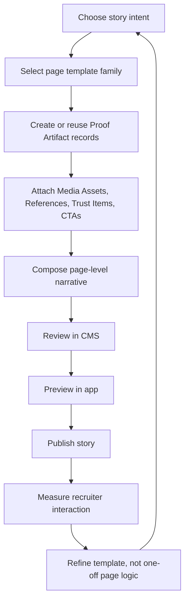

# E2E Story Loop

## Loop Meaning

- Start with the story goal, not the page chrome.
- Reuse canonical proof objects first.
- Compose pages from reusable pieces.
- Improve the template system after each story instead of inventing one-off formats.
