# Page Template Map

```mermaid
flowchart TB
    A[Editorial Issue Page] --> A1[Cover Spread]
    A --> A2[Role Definition Spread]
    A --> A3[System Scope Spread]
    A --> A4[Flagship Proof Spread]
    A --> A5[Outcomes Spread]
    A --> A6[Method Spread]
    A --> A7[Trust Spread]
    A --> A8[Decision Spread]

    B[Track Page] --> B1[Audience framing]
    B --> B2[Prioritized case studies]
    B --> B3[Supporting proof rail]

    C[Context Page] --> C1[Domain frame]
    C --> C2[System explanation]
    C --> C3[Context-specific proof]
    C --> C4[Appendix links]

    D[Case Study Page] --> D1[Challenge]
    D --> D2[System boundaries]
    D --> D3[Architecture]
    D --> D4[Decisions]
    D --> D5[Outcomes]

    E[Proof Library Page] --> E1[Ranked artifacts]
    E --> E2[Filters]
    E --> E3[Search]

    F[Artifact Detail Page] --> F1[One artifact]
    F --> F2[What it proves]
    F --> F3[Related proof]
```

## Reuse Rule

Use a small number of stable page families and scale by changing:

- story sequencing
- page framing
- proof selection
- audience CTA

Do not scale by inventing new page families for every story.
