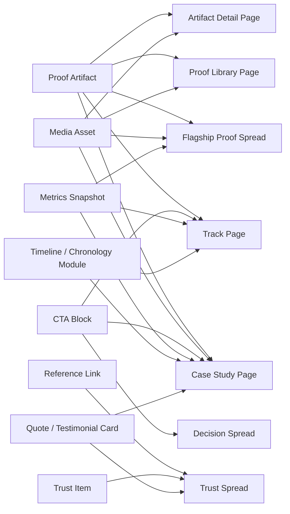

# Component Template Map

```mermaid
flowchart LR
    A[Proof Artifact] --> B[Flagship Proof Spread]
    A --> C[Case Study Page]
    A --> D[Track Page]
    A --> E[Proof Library Page]
    A --> F[Artifact Detail Page]

    G[Media Asset] --> B
    G --> C
    G --> E
    G --> F

    H[CTA Block] --> I[Decision Spread]
    H --> D
    H --> C

    J[Reference Link] --> K[Trust Spread]
    L[Trust Item] --> K

    M[Metrics Snapshot] --> B
    M --> C
    M --> D

    N[Timeline / Chronology Module] --> C
    N --> D

    O[Quote / Testimonial Card] --> K
    O --> C
```

## Reuse Rule

Canonical objects should be shared across page types.
Pages should compose them.
Pages should not own unique copies of the same evidence.
