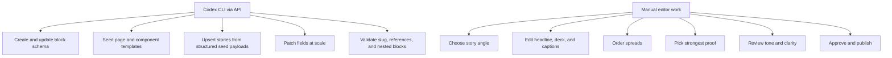

# Storyblok Work Split

## Storyblok Best Use

Storyblok is best when the manual editor is shaping page composition and copy inside a visual editorial workflow.

## Codex Responsibilities

- schema creation
- migration scripts
- seeded story creation
- repeatable bulk patching
- validation of nested block structure

## Manual Responsibilities

- narrative judgment
- image choice
- headline quality
- deciding what proof matters most
- final publishing judgment
