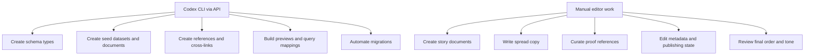

# Sanity Work Split

## Sanity Best Use

Sanity is best when the system is content-model-driven and the team values structured content scale, API leverage, and free-tier headroom more than drag-and-drop editorial feel.

## Codex Responsibilities

- schema generation
- query design
- preview integration
- migrations
- dataset seeding

## Manual Responsibilities

- story curation
- copy editing
- proof selection
- publication review
