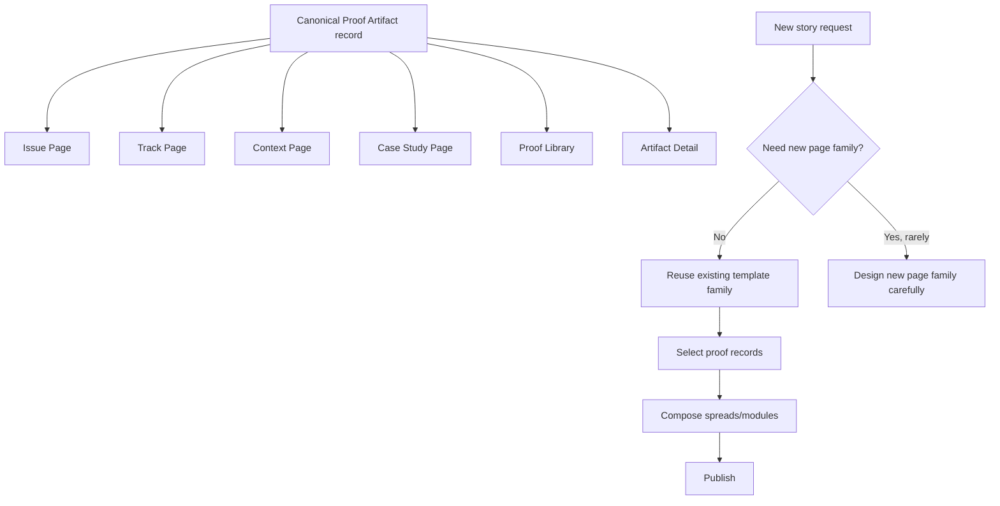

# Scale With Unlimited Stories

## Scalability Rules

- One proof object can feed many pages.
- New stories should usually mean:
  - new records
  - new sequencing
  - new framing
- New stories should rarely mean:
  - new page types
  - new component categories

## Current Build Alignment

These template families already map well to the current app:

- `HomeWizard` for the `Editorial Issue Page`
- `SimpleTrackStoryPage` and `TrackPageTemplate` for `Track Page`
- `SimpleContextStoryPage` and `PortfolioContextPage` for `Context Page`
- `SimpleCaseStudyPage` and `CaseStudyPageTemplate` for `Case Study Page`

That means the fastest path is not inventing more UI families.
The fastest path is feeding those families with a stronger reusable content system.
